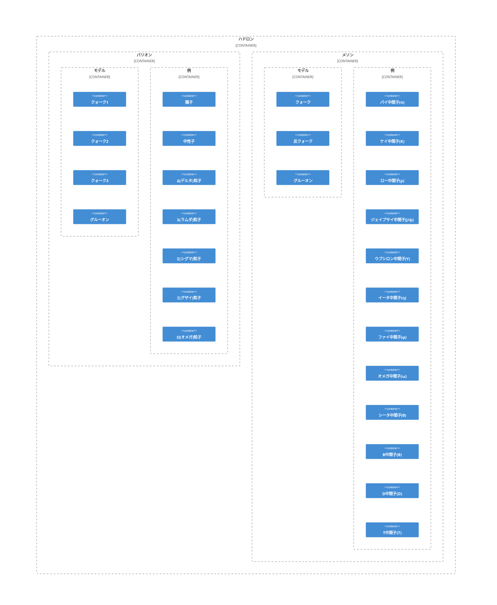

# [ハドロン](https://ja.wikipedia.org/wiki/%E3%83%8F%E3%83%89%E3%83%AD%E3%83%B3)

- 強粒子とも呼ばれる。
- クォーク（と反クォーク）とグルーオンによって構成される。
- 強い相互作用で結びついた複合粒子である。
- 色荷がかならず無色になっている。
  - [クォークの閉じ込め](https://ja.wikipedia.org/wiki/%E3%82%AF%E3%82%A9%E3%83%BC%E3%82%AF%E3%81%AE%E9%96%89%E3%81%98%E8%BE%BC%E3%82%81)

### [バリオン](https://ja.wikipedia.org/wiki/%E3%83%90%E3%83%AA%E3%82%AA%E3%83%B3)

- 3つのクォークから構成されるハドロンである。
- 赤、緑、青の3色の混色になっている。

#### バリオン一覧

- [陽子](https://ja.wikipedia.org/wiki/%E9%99%BD%E5%AD%90)
- [中性子](https://ja.wikipedia.org/wiki/%E4%B8%AD%E6%80%A7%E5%AD%90)
- [Δ(デルタ)粒子](https://ja.wikipedia.org/wiki/%E3%83%87%E3%83%AB%E3%82%BF%E7%B2%92%E5%AD%90)
- [λ(ラムダ)粒子](https://ja.wikipedia.org/wiki/%E3%83%A9%E3%83%A0%E3%83%80%E7%B2%92%E5%AD%90)
- [Σ(シグマ)粒子](https://ja.wikipedia.org/wiki/%E3%82%B7%E3%82%B0%E3%83%9E%E7%B2%92%E5%AD%90)
- [Ξ(グザイ)粒子](https://ja.wikipedia.org/wiki/%E3%82%B0%E3%82%B6%E3%82%A4%E7%B2%92%E5%AD%90)
- [Ω(オメガ)粒子](https://ja.wikipedia.org/wiki/%E3%82%AA%E3%83%A1%E3%82%AC%E7%B2%92%E5%AD%90)

## [メソン](https://ja.wikipedia.org/wiki/%E4%B8%AD%E9%96%93%E5%AD%90)

- 中間子とも呼ばれる。
- クォークと反クォークによって構成される。
- 強い相互作用で結びついた複合粒子である。
- 色と補色の混色になっている。

#### メソン一覧

- [パイ中間子(π)](https://ja.wikipedia.org/wiki/%E3%83%91%E3%82%A4%E4%B8%AD%E9%96%93%E5%AD%90)
- [ケイ中間子(K)](https://ja.wikipedia.org/wiki/K%E4%B8%AD%E9%96%93%E5%AD%90)
- [ロー中間子(ρ)](https://ja.wikipedia.org/wiki/%E3%83%AD%E3%83%BC%E4%B8%AD%E9%96%93%E5%AD%90)
- [ジェイプサイ中間子(J/ψ)](https://ja.wikipedia.org/wiki/%E3%82%B8%E3%82%A7%E3%82%A4%E3%83%97%E3%82%B5%E3%82%A4%E4%B8%AD%E9%96%93%E5%AD%90)
- [ウプシロン中間子(Υ)](https://ja.wikipedia.org/wiki/%E3%82%A6%E3%83%97%E3%82%B7%E3%83%AD%E3%83%B3%E4%B8%AD%E9%96%93%E5%AD%90)
- [イータ中間子(η)](https://ja.wikipedia.org/wiki/%E3%82%A4%E3%83%BC%E3%82%BF%E4%B8%AD%E9%96%93%E5%AD%90)
- [ファイ中間子(φ)](https://ja.wikipedia.org/wiki/%E3%83%95%E3%82%A1%E3%82%A4%E4%B8%AD%E9%96%93%E5%AD%90)
- [オメガ中間子(ω)](https://ja.wikipedia.org/wiki/%E3%82%AA%E3%83%A1%E3%82%AC%E4%B8%AD%E9%96%93%E5%AD%90)
- [シータ中間子(θ)](https://ja.wikipedia.org/wiki/%E3%82%B7%E3%83%BC%E3%82%BF%E4%B8%AD%E9%96%93%E5%AD%90)
- [B中間子(B)](https://ja.wikipedia.org/wiki/%E3%82%B7%E3%83%BC%E3%82%BF%E4%B8%AD%E9%96%93%E5%AD%90)
- [D中間子(D)](https://ja.wikipedia.org/wiki/D%E4%B8%AD%E9%96%93%E5%AD%90)
- [T中間子(T)](https://ja.wikipedia.org/wiki/T%E4%B8%AD%E9%96%93%E5%AD%90)

## 参考

https://japanknowledge.com/contents/common/soryushi.html
