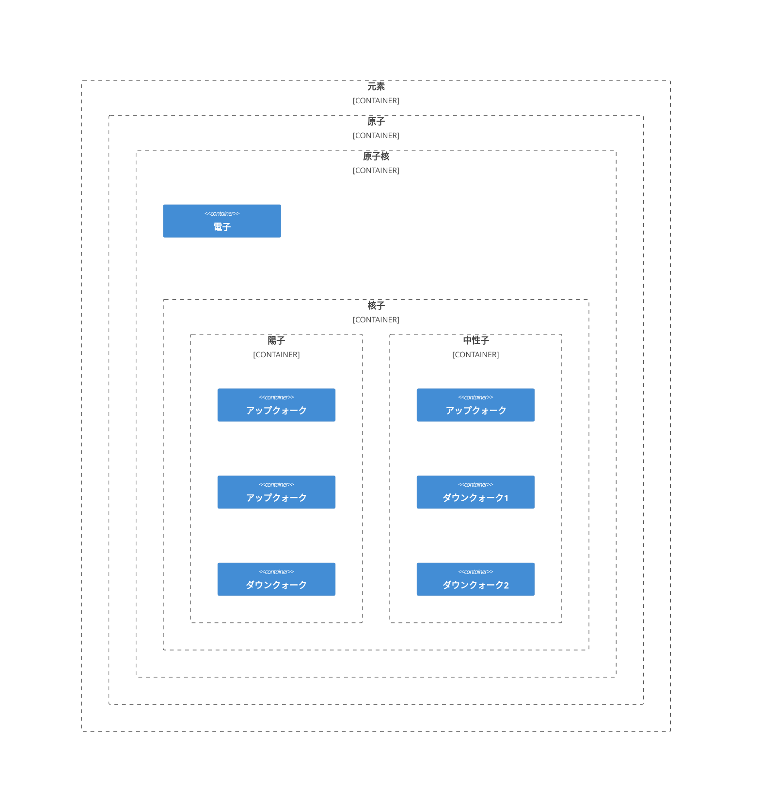

# [物質](https://ja.wikipedia.org/wiki/%E7%89%A9%E8%B3%AA)

### [元素](https://ja.wikipedia.org/wiki/%E5%85%83%E7%B4%A0)

- 性質を包括する抽象的概念

### [分子](https://ja.wikipedia.org/wiki/%E5%88%86%E5%AD%90)

- 2つ以上の原子から構成される。
- 電荷的に中性である。

### [原子](https://ja.wikipedia.org/wiki/%E5%8E%9F%E5%AD%90)

- 元素の最小単位。
- 原子核と電子の電磁相互作用による束縛状態である。

### [原子核](https://ja.wikipedia.org/wiki/%E5%8E%9F%E5%AD%90%E6%A0%B8)

- 原子の中心に位置する核子の塊である。
- 正の電荷を帯びている。

### [核子](https://ja.wikipedia.org/wiki/%E6%A0%B8%E5%AD%90)

- 原子核を構成する陽子と中性子の総称。

### [陽子](https://ja.wikipedia.org/wiki/%E9%99%BD%E5%AD%90)

- 原子核を構成する粒子のうち、正の電荷をもつ粒子である。
- 2個のアップクォークと1個のダウンクォークで構成されるバリオンである。

### [中性子](https://ja.wikipedia.org/wiki/%E4%B8%AD%E6%80%A7%E5%AD%90)

- 原子核を構成する粒子のうち、無電荷の粒子である。
- 2個のダウンクォークと1個のアップクォークで構成されるバリオンである。
