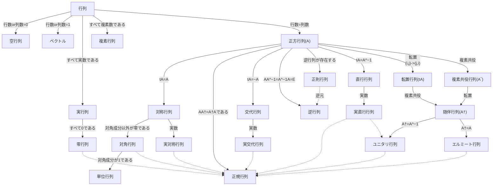

## [行列](https://ja.wikipedia.org/wiki/%E8%A1%8C%E5%88%97)

- 数や記号や式などを縦と横に矩形状に配列したものである。
- 横に並んだ一筋を行(row)、縦に並んだ一筋を列(column)と呼ぶ。
- 行数をm、列数をnで表す。
- i行目、j列目の要素を(i,j)成分と言う。
- 行列は大文字アルファベットで表す。 ex. A
- 抽象的な表現はA=[aij]となる。

|  A  |     |     |  n  |     |     |
| :-: | :-: | :-: | :-: | :-: | :-: |
|     | aij | j=1 | j=2 | j=3 | j=4 |
|     | i=1 | a11 | a12 | a13 | a14 |
|**m**| i=2 | a21 | a22 | a23 | a24 |
|     | i=3 | a31 | a32 | a33 | a34 |

## 空行列

- 行数もしくは列数が0である。

## 列ベクトル

## 実行列

- 成分がすべて実数である。

|     |     |     |     |  
| --- | --- | --- | --- |  
|  1  |  2  |  3  |  4  |  
|  5  |  6  |  7  |  8  |

## [零行列](https://ja.wikipedia.org/wiki/%E9%9B%B6%E8%A1%8C%E5%88%97)

- 成分がすべて0である。

|     |     |     |     |  
| --- | --- | --- | --- |  
|  0  |  0  |  0  |  0  |  
|  0  |  0  |  0  |  0  |

## 複素行列

- 成分がすべて複素数である。

|     |     |     |     |  
| --- | --- | --- | --- |  
|  1i |  2i |  3i |  4i |  
|  5i |  6i |  7i |  8i |

## [正方行列](https://ja.wikipedia.org/wiki/%E6%AD%A3%E6%96%B9%E8%A1%8C%E5%88%97)

- 行要素の数と列要素の数が一致する。

|     |     |     |
| --- | --- | --- |
|  1  |  2  |  3  |
|  4  |  5  |  6  |
|  7  |  8  |  9  |
 
## [対称行列](https://ja.wikipedia.org/wiki/%E5%AF%BE%E7%A7%B0%E8%A1%8C%E5%88%97)

- 正方行列である。
- 対称性がある。
- 自身の転置行列と一致する。
- 転置に対して対称性を持つ。

|     |     |     |
| --- | --- | --- |
|  1  |  2  |  3  |
|  2  |  4  |  5  |
|  3  |  5  |  6  |

## [対角行列](https://ja.wikipedia.org/wiki/%E5%AF%BE%E8%A7%92%E8%A1%8C%E5%88%97)

- 正方行列である。
- 対角成分以外が零である。

|     |     |     |
| --- | --- | --- |
|  1  |  0  |  0  |
|  0  |  2  |  0  |
|  0  |  0  |  3  |

## [単位行列](https://ja.wikipedia.org/wiki/%E5%8D%98%E4%BD%8D%E8%A1%8C%E5%88%97)

- 正方行列である。
- 対角行列である。
- 対称行列である。
- 対角成分に1が並び、他は全て0となる。

|     |     |     |
| --- | --- | --- |
|  1  |  0  |  0  |
|  0  |  1  |  0  |
|  0  |  0  |  1  |

### スカラー行列

- 単位行列をスカラー倍した。

## [交代行列](https://ja.wikipedia.org/wiki/%E4%BA%A4%E4%BB%A3%E8%A1%8C%E5%88%97)

- 歪対称行列（skew-symmetric matrix）とも言う。
- 反対称行列（antisymmetric matrix）とも言う。
- 正方行列である。
- 転置行列が自身の −1 倍となる。
- 転置に対して反対称性を持つ。

|     |     |     |
| --- | --- | --- |
|  0  |  1  |  2  |
| -1  |  0  |  3  |
| -2  | -3  |  0  |

## [正規行列](https://ja.wikipedia.org/wiki/%E6%AD%A3%E8%A6%8F%E8%A1%8C%E5%88%97)

- AA†=A†Aである。
- 正方行列である。
- 対称性がある。

|     |     |     |
| --- | --- | --- |
|  0  |  0  |  2  |
|  2  |  0  |  0  |
|  0  |  2  |  0  |
 
## [正則行列](https://ja.wikipedia.org/wiki/%E6%AD%A3%E5%89%87%E8%A1%8C%E5%88%97)

- 非特異行列とも言う。
- 可逆行列とも言う。
- 正方行列である。
- 逆行列が存在する。

|     |     |     |
| --- | --- | --- |
|  1  |  2  | -1  |
|  2  |  3  |  2  |
| -3  | -3  |  0  |

## 逆行列

- 正方行列である。
- AA^−1=A^−1A=Eが成り立つ。
- ある行列で線形変換した空間を元に戻す。
- 行列における割り算とされる。
- 通常の積に関する逆元を持つ。

|     |     |     |
| --- | --- | --- |
|  0  |  0  |  2  |
|  2  |  0  |  0  |
|  0  |  2  |  0  |

### [逆元](https://ja.wikipedia.org/wiki/%E9%80%86%E5%85%83)

- 数の加法に対する反数や乗法に関する逆数の概念の一般化である。
- 与えられた元に結合してその効果を「打ち消す」効果を持つ元のことである。

## [直交行列](https://ja.wikipedia.org/wiki/%E7%9B%B4%E4%BA%A4%E8%A1%8C%E5%88%97)

- 転置行列と逆行列が等しい。
- 正方行列である。
- 正則行列である。

### 反射行列

### 回転行列

### 置換行列

## [転置行列](https://ja.wikipedia.org/wiki/%E8%BB%A2%E7%BD%AE%E8%A1%8C%E5%88%97)

- 要素を入れ替えてできる。
- 被作用

## 複素共役行列

- すべての成分の共役複素数を成分とする。

## [随伴行列](https://ja.wikipedia.org/wiki/%E9%9A%8F%E4%BC%B4%E8%A1%8C%E5%88%97)

- エルミート転置 (Hermitian transpose)とも言う。
- エルミート共軛 (Hermitian conjugate)とも言う。
- エルミート随伴 (Hermitian adjoint) とも言う。

## [ユニタリ行列](https://ja.wikipedia.org/wiki/%E3%83%A6%E3%83%8B%E3%82%BF%E3%83%AA%E8%A1%8C%E5%88%97)

- 正方行列である。
- 正規行列である。
- 直交行列を複素数体へ拡張した。

## [エルミート行列](https://ja.wikipedia.org/wiki/%E3%82%A8%E3%83%AB%E3%83%9F%E3%83%BC%E3%83%88%E8%A1%8C%E5%88%97)

- 自己随伴行列（self-adjoint matrix）とも言う。
- 正方行列である。
- 複素数に成分をとる。
- 自身の随伴行列（共軛転置）と一致する。
- 対称性がある。

## [共役/共軛](https://ja.wikipedia.org/wiki/%E5%85%B1%E5%BD%B9)

- 2つのものがセットになって結びついている。
- 同様の働きをする。

### [複素共役](https://ja.wikipedia.org/wiki/%E8%A4%87%E7%B4%A0%E5%85%B1%E5%BD%B9)

- 複素数の虚部を反数にした複素数をとる。

## [行列式](https://ja.wikipedia.org/wiki/%E8%A1%8C%E5%88%97%E5%BC%8F)

- 正方行列に対して定義される。
- 線型変換に対して線形空間の拡大率と言える。
- 逆行列の導出に利用される。

