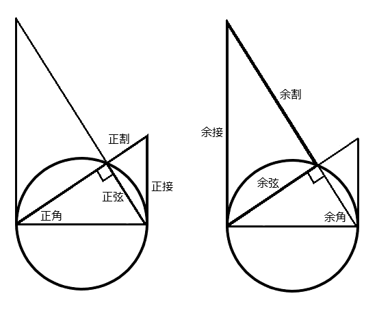
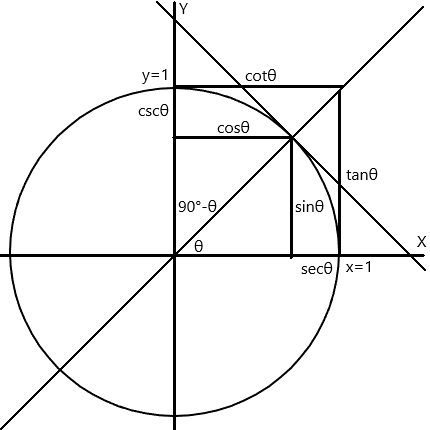

# [三角関数](https://ja.wikipedia.org/wiki/%E4%B8%89%E8%A7%92%E9%96%A2%E6%95%B0)

角の大きさと線分の長さの関係を記述する。

- 基準: 
  - 正角: $\theta$
  - 余角: $90^\circ- \theta$
  - 接線: ある曲線に1点で交わる直線のことです。
  - 割線: ある曲線に2点以上で交わる直線のことです。
- 分類
  - 正弦: sin(e)
    - 正角に対する弦を示す。
  - 正割: sec(ant)
    - 正角に対する割線を示す。
  - 正接: tan(gent)
    - 正角に対する接線を示す。
  - 余弦: cos(ine)
    - 余角に対する弦を示す。
  - 余割: cosec(ant), csc
    - 余角に対する割線を示す。
  - 余接: cot(angent)
    - 余角に対する接線を示す。

## 直角三角形による定義

## 単位円による定義

## 加法定理

## 参考

- [あなたと夜と数学と - なぜサインは正弦？](http://simomath.blog.fc2.com/blog-entry-569.html)
- [八線](http://yamada-kuebiko.cocolog-nifty.com/photos/uncategorized/2015/03/03/hassen.png)