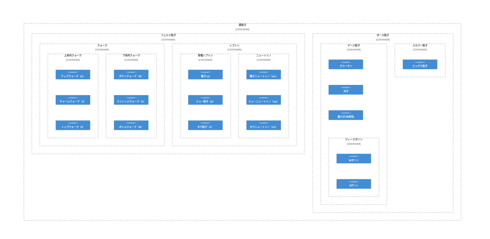

# [素粒子](https://ja.wikipedia.org/wiki/%E7%B4%A0%E7%B2%92%E5%AD%90)

フェルミ統計に従うフェルミ粒子、ボース統計に従うボース粒子の二種類に分類される。

### [フェルミ粒子](https://ja.wikipedia.org/wiki/%E3%83%95%E3%82%A7%E3%83%AB%E3%83%9F%E7%B2%92%E5%AD%90)

- 素粒子のグループの一つである。
- \hbar の半整数 (1/2, 3/2, 5/2, …)倍のスピンを伴う粒子の総称である。
- フェルミオンとも呼ばれる。

#### [クォーク](https://ja.wikipedia.org/wiki/%E3%82%AF%E3%82%A9%E3%83%BC%E3%82%AF)

フェルミ粒子の一つである。

- 上系列クォーク（up-type quark）
  - アップクォーク（u）
  - チャームクォーク（c）
  - トップクォーク（t）
- 下系列クォーク（down-type quark）
  - ダウンクォーク（d）
  - ストレンジクォーク（s）
  - ボトムクォーク（b）

#### [レプトン](https://ja.wikipedia.org/wiki/%E3%83%AC%E3%83%97%E3%83%88%E3%83%B3_(%E7%B4%A0%E7%B2%92%E5%AD%90))

- フェルミ粒子の一つである。
- 荷電レプトンおよびニュートリノに分類される。
- それぞれに[反粒子](https://ja.wikipedia.org/wiki/%E5%8F%8D%E7%B2%92%E5%AD%90)が存在する。
- 軽粒子とも呼ばれる。

##### 荷電レプトン（charged-lepton）

- 電荷をもつ。

###### [電子 (e)](https://ja.wikipedia.org/wiki/%E9%9B%BB%E5%AD%90)

- 原子核を構成する粒子のうち、負の電荷をもつ粒子である。

###### ミュー粒子（μ）

###### タウ粒子（τ）

##### [ニュートリノ](https://ja.wikipedia.org/wiki/%E3%83%8B%E3%83%A5%E3%83%BC%E3%83%88%E3%83%AA%E3%83%8E)

- 電荷を持たない。
- 他の物質と相互作用することはほとんどない。

###### 電子ニュートリノ（νe）

###### ミューニュートリノ（νμ）

###### タウニュートリノ（ντ）

#### [電荷](https://ja.wikipedia.org/wiki/%E9%9B%BB%E8%8D%B7)

- 粒子や物体が帯びている電気の量である。
- 電磁場から受ける作用の大きさを規定する物理量である。 
- 荷電ともいう。

### [ボース粒子（ボソン）](https://ja.wikipedia.org/wiki/%E3%83%9C%E3%83%BC%E3%82%B9%E7%B2%92%E5%AD%90)

- 素粒子のグループの一つである。
- \hbar の整数倍のスピンを伴う粒子の総称である。

#### [ゲージ粒子](https://ja.wikipedia.org/wiki/%E3%82%B2%E3%83%BC%E3%82%B8%E7%B2%92%E5%AD%90)

- ボース粒子の一つである。
- 素粒子間の相互作用を伝達する。
- [ベクトル粒子](https://ja.wikipedia.org/wiki/%E3%83%99%E3%82%AF%E3%83%88%E3%83%AB%E7%B2%92%E5%AD%90
)

###### [グルーオン](https://ja.wikipedia.org/wiki/%E3%82%B0%E3%83%AB%E3%83%BC%E3%82%AA%E3%83%B3)

- ゲージ粒子の1つである。
- [強い相互作用](https://ja.wikipedia.org/wiki/%E5%BC%B7%E3%81%84%E7%9B%B8%E4%BA%92%E4%BD%9C%E7%94%A8)を伝える。
- スピン1のボース粒子である。
- 質量は0。
- 電荷は中性。
- [色荷](https://ja.wikipedia.org/wiki/%E8%89%B2%E8%8D%B7)を持つ。

###### [ウィークボソン](https://ja.wikipedia.org/wiki/%E3%82%A6%E3%82%A3%E3%83%BC%E3%82%AF%E3%83%9C%E3%82%BD%E3%83%B3)

- ゲージ粒子の1つである。
- [弱い相互作用](https://ja.wikipedia.org/wiki/%E5%BC%B1%E3%81%84%E7%9B%B8%E4%BA%92%E4%BD%9C%E7%94%A8)を媒介する。
- 弱ボソンとも呼ばれる。
- W+-ボソンとZボソンの二種類が存在する。

###### [光子](https://ja.wikipedia.org/wiki/%E5%85%89%E5%AD%90)

- ゲージ粒子の1つである。
- 光量子とも呼ばれる。
- 電磁相互作用を媒介する。

###### [重力子（グラビトン）](https://ja.wikipedia.org/wiki/%E9%87%8D%E5%8A%9B%E5%AD%90)

- ゲージ粒子の1つである。
- [重力相互作用](https://ja.wikipedia.org/wiki/%E9%87%8D%E5%8A%9B%E7%9B%B8%E4%BA%92%E4%BD%9C%E7%94%A8)を媒介する。
- 未発見である。

#### [スカラー粒子](https://ja.wikipedia.org/wiki/%E3%82%B9%E3%82%AB%E3%83%A9%E3%83%BC%E7%B2%92%E5%AD%90)

- ボース粒子の一つである。

##### [ヒッグス粒子](https://ja.wikipedia.org/wiki/%E3%83%92%E3%83%83%E3%82%B0%E3%82%B9%E7%B2%92%E5%AD%90)

- スカラー粒子の一つである。
- 素粒子に質量を与える。
- ヒッグス機構において存在が予想された。
- H0, H+-,h,A0
