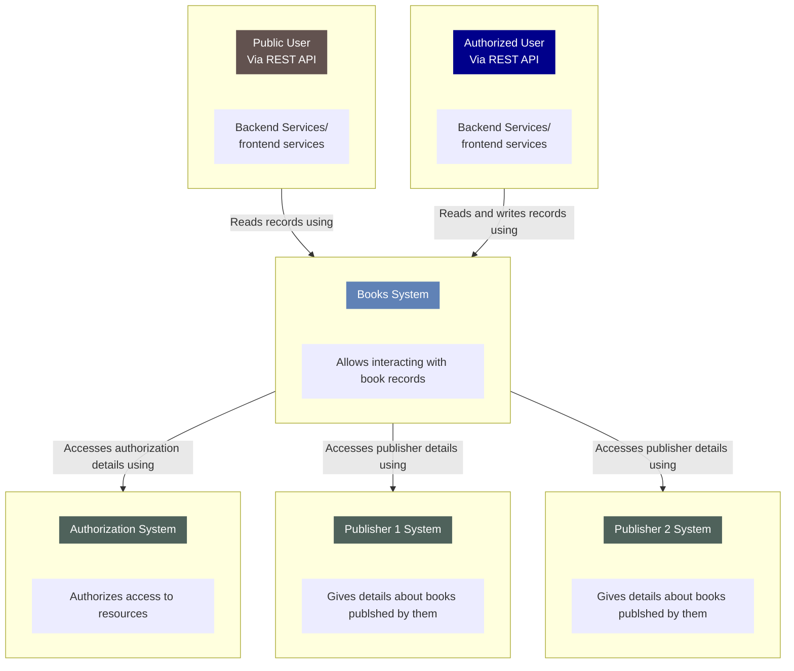

# 物理学

個人的な整理の為の覚書です。

https://github.com/csymapp/mermaid-c4-model/blob/master/README.md

## 物質

### [元素](https://ja.wikipedia.org/wiki/%E5%85%83%E7%B4%A0)

「原子」が《物質を構成する具体的要素》を指すのに対し「元素」は《性質を包括する抽象的概念》を示す。

### [原子](https://ja.wikipedia.org/wiki/%E5%8E%9F%E5%AD%90)

元素の最小単位。その実態は原子核と電子の電磁相互作用による束縛状態である。

### [原子核](https://ja.wikipedia.org/wiki/%E5%8E%9F%E5%AD%90%E6%A0%B8)

- 原子の中心に位置する核子の塊である。
- 正の電荷を帯びている。

### [核子](https://ja.wikipedia.org/wiki/%E6%A0%B8%E5%AD%90)

原子核を構成する陽子と中性子の総称。

### [陽子](https://ja.wikipedia.org/wiki/%E9%99%BD%E5%AD%90)

- 原子核を構成する粒子のうち、正の電荷をもつ粒子である。
- 2個のアップクォークと1個のダウンクォークで構成されるバリオンである。

### [中性子](https://ja.wikipedia.org/wiki/%E4%B8%AD%E6%80%A7%E5%AD%90)

- 原子核を構成する粒子のうち、無電荷の粒子である。
- 2個のダウンクォークと1個のアップクォークで構成されるバリオンである。

### [バリオン](https://ja.wikipedia.org/wiki/%E3%83%90%E3%83%AA%E3%82%AA%E3%83%B3)

3つのクォークから構成されるハドロンである。

### [ハドロン](https://ja.wikipedia.org/wiki/%E3%83%8F%E3%83%89%E3%83%AD%E3%83%B3)

- 素粒子標準模型において強い相互作用で結びついた複合粒子のグループである。
- 強粒子とも呼ばれる。
- ハドロンはクォーク（と反クォーク）とグルーオンによって構成される。

### [素粒子](https://ja.wikipedia.org/wiki/%E7%B4%A0%E7%B2%92%E5%AD%90)

フェルミ統計に従うフェルミ粒子、ボース統計に従うボース粒子の二種類に分類される。

### [フェルミ粒子](https://ja.wikipedia.org/wiki/%E3%83%95%E3%82%A7%E3%83%AB%E3%83%9F%E7%B2%92%E5%AD%90)

- 素粒子のグループの一つである。
- \hbar の半整数 (1/2, 3/2, 5/2, …)倍のスピンを伴う粒子の総称である。
- フェルミオンとも呼ばれる。

#### [クォーク](https://ja.wikipedia.org/wiki/%E3%82%AF%E3%82%A9%E3%83%BC%E3%82%AF)

フェルミ粒子の一つである。

- 上系列クォーク（up-type quark）
  - アップクォーク（u）
  - チャームクォーク（c）
  - トップクォーク（t）
- 下系列クォーク（down-type quark）
  - ダウンクォーク（d）
  - ストレンジクォーク（s）
  - ボトムクォーク（b）

#### [レプトン](https://ja.wikipedia.org/wiki/%E3%83%AC%E3%83%97%E3%83%88%E3%83%B3_(%E7%B4%A0%E7%B2%92%E5%AD%90))

- フェルミ粒子の一つである。
- 荷電レプトンおよびニュートリノに分類される。
- それぞれに[反粒子](https://ja.wikipedia.org/wiki/%E5%8F%8D%E7%B2%92%E5%AD%90)が存在する。

##### 荷電レプトン（charged-lepton）

- 電荷をもつ。

###### [電子 (e)](https://ja.wikipedia.org/wiki/%E9%9B%BB%E5%AD%90)

- 原子核を構成する粒子のうち、負の電荷をもつ粒子である。

###### ミュー粒子（μ）

###### タウ粒子（τ）

##### [ニュートリノ](https://ja.wikipedia.org/wiki/%E3%83%8B%E3%83%A5%E3%83%BC%E3%83%88%E3%83%AA%E3%83%8E)

- 電荷を持たない。
- 他の物質と相互作用することはほとんどない。

###### 電子ニュートリノ（νe）

###### ミューニュートリノ（νμ）

###### タウニュートリノ（ντ）

#### [電荷](https://ja.wikipedia.org/wiki/%E9%9B%BB%E8%8D%B7)

- 粒子や物体が帯びている電気の量である。
- 電磁場から受ける作用の大きさを規定する物理量である。 
- 荷電ともいう。

### [ボース粒子（ボソン）](https://ja.wikipedia.org/wiki/%E3%83%9C%E3%83%BC%E3%82%B9%E7%B2%92%E5%AD%90)

- 素粒子のグループの一つである。
- \hbar の整数倍のスピンを伴う粒子の総称である。

#### ヒッグス粒子

ボース粒子の一つである。素粒子に質量を与える。ヒッグス機構において存在が予想された。

#### [ゲージ粒子](https://ja.wikipedia.org/wiki/%E3%82%B2%E3%83%BC%E3%82%B8%E7%B2%92%E5%AD%90)

素粒子間の相互作用を伝達する。

##### [基本相互作用](https://ja.wikipedia.org/wiki/%E5%9F%BA%E6%9C%AC%E7%9B%B8%E4%BA%92%E4%BD%9C%E7%94%A8)

###### [グルーオン](https://ja.wikipedia.org/wiki/%E3%82%B0%E3%83%AB%E3%83%BC%E3%82%AA%E3%83%B3)

- ゲージ粒子の1つである。
- [強い相互作用](https://ja.wikipedia.org/wiki/%E5%BC%B7%E3%81%84%E7%9B%B8%E4%BA%92%E4%BD%9C%E7%94%A8)を伝える。
- スピン1のボース粒子である。
- 質量は0。
- 電荷は中性。
- [色荷](https://ja.wikipedia.org/wiki/%E8%89%B2%E8%8D%B7)を持つ。

###### [ウィークボソン](https://ja.wikipedia.org/wiki/%E3%82%A6%E3%82%A3%E3%83%BC%E3%82%AF%E3%83%9C%E3%82%BD%E3%83%B3)

- ゲージ粒子の1つである。
- [弱い相互作用](https://ja.wikipedia.org/wiki/%E5%BC%B1%E3%81%84%E7%9B%B8%E4%BA%92%E4%BD%9C%E7%94%A8)を媒介する。
- 弱ボソンとも呼ばれる。
- WボソンとZボソンの二種類が存在する。

###### [光子](https://ja.wikipedia.org/wiki/%E5%85%89%E5%AD%90)

- ゲージ粒子の1つである。
- 光量子とも呼ばれる。
- 電磁相互作用を媒介する。

####### [電磁相互作用](https://ja.wikipedia.org/wiki/%E9%9B%BB%E7%A3%81%E7%9B%B8%E4%BA%92%E4%BD%9C%E7%94%A8)

- 電場あるいは磁場から電荷が力を受ける相互作用である。
- 電磁相互作用で発生する力は電磁気力（でんじきりょく）である。
- 電荷にはプラスとマイナスがある。
- 同じもの同士で斥力、異なるもの同士で引力が働く。
- 電磁相互作用を媒介する光子を仮想光子と呼ぶ事もある。

####### [電磁波](https://ja.wikipedia.org/wiki/%E9%9B%BB%E7%A3%81%E6%B3%A2)

- 電場と磁場の変化を伝搬する波（[波動](https://ja.wikipedia.org/wiki/%E6%B3%A2%E5%8B%95)）である。
  - [磁場](https://ja.wikipedia.org/wiki/%E7%A3%81%E5%A0%B4)
  - [電場](https://ja.wikipedia.org/wiki/%E9%9B%BB%E5%A0%B4)
- 波と粒子の性質を併せ持つ。
- 量子は光子である。

##### [光](https://ja.wikipedia.org/wiki/%E5%85%89)

電磁波の1種。

###### [重力子（グラビトン）

- ゲージ粒子の1つである。
- [重力相互作用](https://ja.wikipedia.org/wiki/%E9%87%8D%E5%8A%9B%E7%9B%B8%E4%BA%92%E4%BD%9C%E7%94%A8)を媒介する。
- 未発見である。

[重力](https://ja.wikipedia.org/wiki/%E9%87%8D%E5%8A%9B)

## 理論

### ニュートン力学

### 特殊相対性理論

### 一般相対性理論

### [統一場理論](https://ja.wikipedia.org/wiki/%E7%B5%B1%E4%B8%80%E5%A0%B4%E7%90%86%E8%AB%96)

### [超弦理論](https://ja.wikipedia.org/wiki/%E8%B6%85%E5%BC%A6%E7%90%86%E8%AB%96)

### [電磁気学](https://ja.wikipedia.org/wiki/%E9%9B%BB%E7%A3%81%E6%B0%97%E5%AD%A6)
