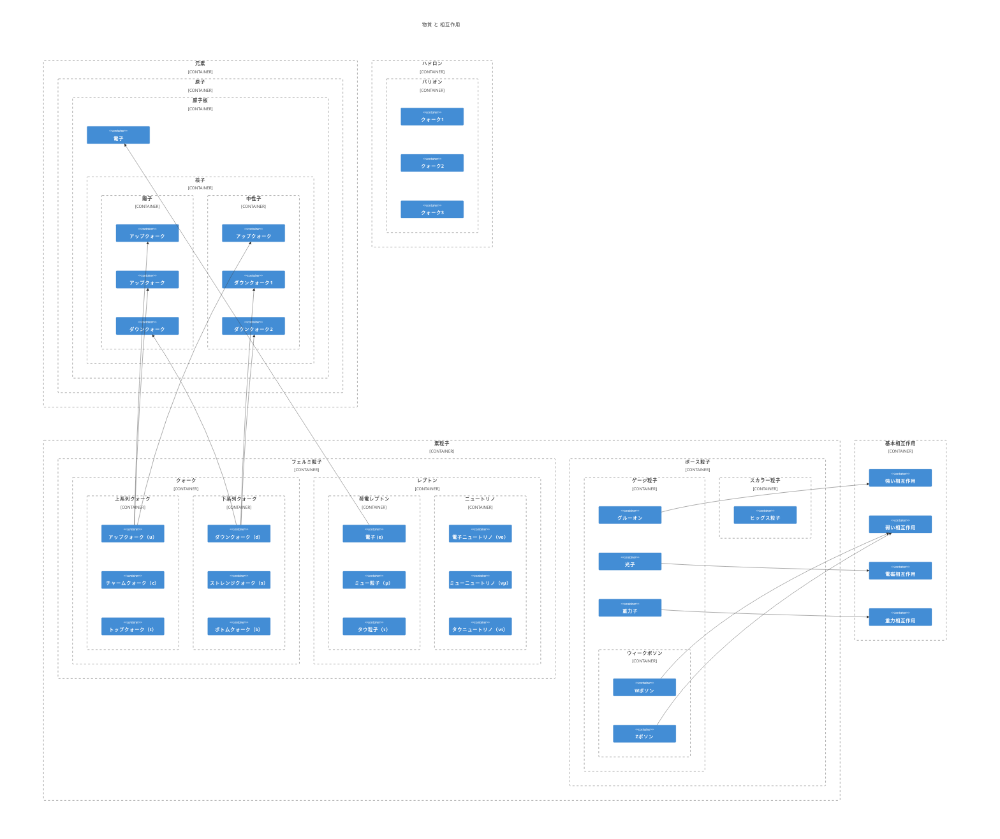

# 物理学

個人的な整理の為の覚書です。

- [物質](./Material.md)
- [相互作用](./Interaction.md)
- [理論](./Theory.md)

## TODO

- 元素の位置づけの見直し
- [粒子統計](https://ja.wikipedia.org/wiki/%E7%B2%92%E5%AD%90%E7%B5%B1%E8%A8%88)
- [スピン](https://ja.wikipedia.org/wiki/%E3%82%B9%E3%83%94%E3%83%B3%E8%A7%92%E9%81%8B%E5%8B%95%E9%87%8F)
- [世代](https://ja.wikipedia.org/wiki/%E4%B8%96%E4%BB%A3_(%E7%B4%A0%E7%B2%92%E5%AD%90))
- [電荷](https://ja.wikipedia.org/wiki/%E9%9B%BB%E8%8D%B7)
- [色荷](https://ja.wikipedia.org/wiki/%E8%89%B2%E8%8D%B7)
- [反粒子](https://ja.wikipedia.org/wiki/%E5%8F%8D%E7%B2%92%E5%AD%90)
- [バリオン数](https://ja.wikipedia.org/wiki/%E3%83%90%E3%83%AA%E3%82%AA%E3%83%B3%E6%95%B0)
- [中間子](https://ja.wikipedia.org/wiki/%E4%B8%AD%E9%96%93%E5%AD%90)
- [複合粒子](https://ja.wikipedia.org/wiki/%E8%A4%87%E5%90%88%E7%B2%92%E5%AD%90)
- [紐](https://en.wikipedia.org/wiki/String_(physics))

