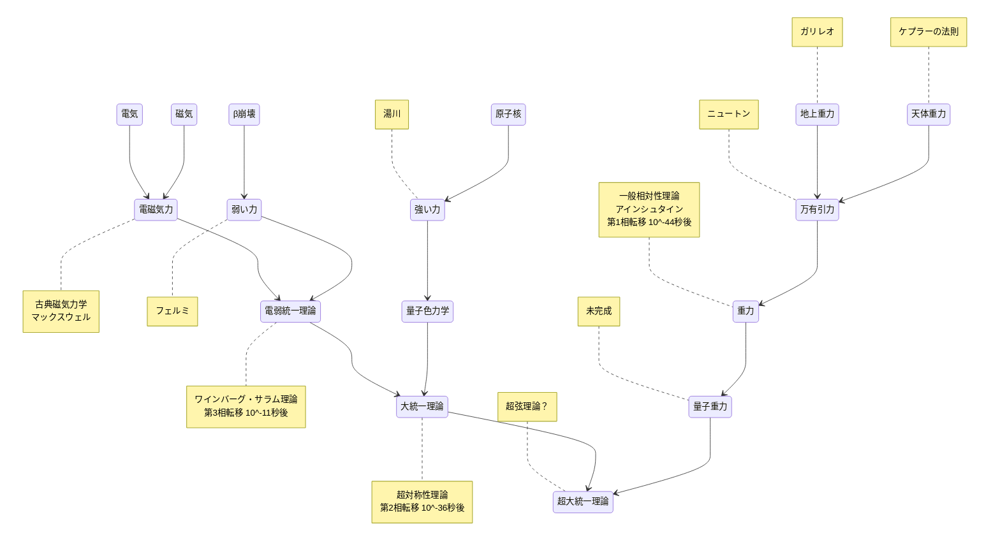

# 理論

## [ワインバーグ・サラム理論](https://ja.wikipedia.org/wiki/%E3%83%AF%E3%82%A4%E3%83%B3%E3%83%90%E3%83%BC%E3%82%B0%EF%BC%9D%E3%82%B5%E3%83%A9%E3%83%A0%E7%90%86%E8%AB%96)

## [ケプラーの法則](https://ja.wikipedia.org/wiki/%E3%82%B1%E3%83%97%E3%83%A9%E3%83%BC%E3%81%AE%E6%B3%95%E5%89%87)

## [ニュートン力学](https://ja.wikipedia.org/wiki/%E3%83%8B%E3%83%A5%E3%83%BC%E3%83%88%E3%83%B3%E5%8A%9B%E5%AD%A6)

## [万有引力](https://ja.wikipedia.org/wiki/%E4%B8%87%E6%9C%89%E5%BC%95%E5%8A%9B)

## [相対性理論](https://ja.wikipedia.org/wiki/%E7%9B%B8%E5%AF%BE%E6%80%A7%E7%90%86%E8%AB%96)

### [特殊相対性理論](https://ja.wikipedia.org/wiki/%E7%89%B9%E6%AE%8A%E7%9B%B8%E5%AF%BE%E6%80%A7%E7%90%86%E8%AB%96)

### [一般相対性理論](https://ja.wikipedia.org/wiki/%E4%B8%80%E8%88%AC%E7%9B%B8%E5%AF%BE%E6%80%A7%E7%90%86%E8%AB%96)

## [量子重力](https://ja.wikipedia.org/wiki/%E9%87%8F%E5%AD%90%E9%87%8D%E5%8A%9B%E7%90%86%E8%AB%96)

## [統一場理論](https://ja.wikipedia.org/wiki/%E7%B5%B1%E4%B8%80%E5%A0%B4%E7%90%86%E8%AB%96)

## [超弦理論](https://ja.wikipedia.org/wiki/%E8%B6%85%E5%BC%A6%E7%90%86%E8%AB%96)

- 仮説である。
- 大きさが無限に小さな0次元の点粒子ではなく、1次元の拡がりをもつ弦であると考える弦理論に、超対称性という考えを加え、拡張したもの。

## [電磁気学](https://ja.wikipedia.org/wiki/%E9%9B%BB%E7%A3%81%E6%B0%97%E5%AD%A6)

## [繰り込み](https://ja.wikipedia.org/wiki/%E7%B9%B0%E3%82%8A%E8%BE%BC%E3%81%BF)

- 計算結果が無限大に発散してしまうのを防ぐ数学的な技法である。
- 場の量子論が満たすべき最重要な原理のひとつでもある。
- 電磁相互作用に適用した量子電磁力学が完成した。

## [摂動](https://ja.wikipedia.org/wiki/%E6%91%82%E5%8B%95)

- 主要な力の寄与（主要項）による運動が、他の副次的な力の寄与（摂動項）によって乱される現象である。
- 粒子の運動が複数粒子の間に相互作用が働くことによって乱れることも指す。
